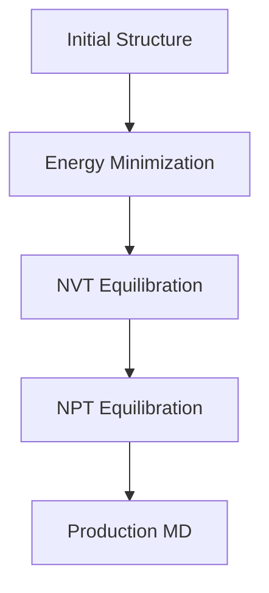

# DC-DFTB-MD Input Preparation

 
## Overview

Input preparation is the first step before performing DC-DFTB-MD simulation.

The input files define the atomic system, simulation parameters, and computational settings required for molecular dynamics calculation.

A properly prepared input system ensures that the simulation runs correctly and produces reliable trajectory data.

## Input Workflow

## Main Input Components

### 1. Atomic Structure

The atomic structure defines the initial configuration of the simulation system.

The structure can be generated from:

- Packmol
- Crystal structure builders
- Interface construction tools
- Previous simulation results

Common structure formats:

- XYZ
- CIF
- PDB

Important information:

- Atomic species
- Atomic coordinates
- Simulation box dimensions
- Periodic boundary conditions

### 2. Chemical Parameters

DC-DFTB-MD requires parameters describing atomic interactions.

These parameters control:

- Electronic interaction
- Atomic forces
- Energy calculation

Common components include:

- Slater-Koster files
- Repulsive potentials
- Parameter sets

### 3. Molecular Dynamics Control Parameters

MD parameters define how the simulation evolves with time.

Important parameters include:

- Ensemble selection
- Temperature
- Pressure
- Time step
- Number of simulation steps

Examples:

- NVT equilibration
- NPT equilibration
- Production MD

## Ensemble Setup

Different simulation stages require different ensemble conditions.

Typical workflow:

## Input Validation

Before running the simulation, check:

- Correct atomic composition
- Valid parameter files
- Reasonable simulation box
- Correct boundary conditions
- Appropriate simulation settings

## Connection to HPC

After the input files are prepared, the simulation can be submitted to an HPC environment.

The next stage covers:

- Job submission
- Parallel execution
- Simulation monitoring
