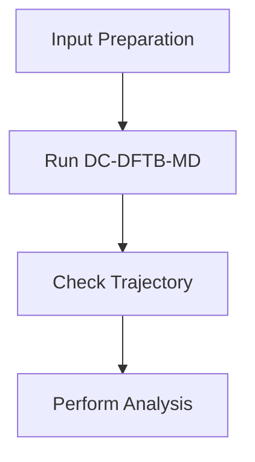

# DC-DFTB-MD Workflow

## Overview

DC-DFTB-MD (Divide-and-Conquer Density Functional Tight Binding Molecular Dynamics) is an atomistic simulation method used to study large-scale materials systems with quantum-based interactions.

This workflow combines electronic structure calculation with molecular dynamics simulation to describe atomic movement over time.

## Role in Atomistic Simulation Workflow

DC-DFTB-MD starts after the initial atomic structure has been prepared.

The general workflow is:

i## Simulation Workflow

The DC-DFTB-MD workflow consists of several stages.

### 1. Input Preparation

The initial structure and simulation parameters are prepared before running the calculation.

Main components:

- Atomic structure file
- Chemical parameters
- Simulation conditions
- MD control parameters

### 2. Molecular Dynamics Simulation

During simulation, atomic positions are updated according to calculated forces.

Important parameters include:

- Temperature
- Pressure
- Time step
- Simulation duration
- Ensemble selection

### 3. HPC Execution

Large-scale molecular dynamics requires computational resources.

The simulation is executed using:

- Parallel computing
- Job scheduler
- HPC environment

### 4. Trajectory Generation

The simulation produces trajectory files containing atomic movement information.

The trajectory can be used for:

- Structural analysis
- Diffusion calculation
- Radial Distribution Function (RDF)
- Mean Square Displacement (MSD)

## Learning Path

The recommended sequence:

