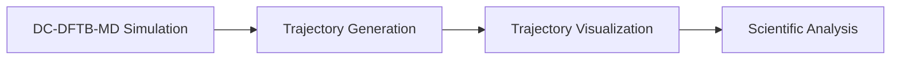

# Trajectory Analysis Preparation

## Overview

Trajectory files record the atomic movement generated during molecular dynamics simulation.

The trajectory contains the time evolution of atomic positions and provides the basis for understanding structural and transport properties of materials.

## Role of Trajectory in Molecular Dynamics

During MD simulation, atoms continuously move according to calculated forces.

The simulation stores these atomic configurations at different time steps as trajectory data.

The general workflow is:

## Trajectory Information

A trajectory file may contain several types of information:

- Atomic positions
- Atomic velocities
- Simulation time
- Energy evolution
- Temperature
- Pressure

## Trajectory File Purpose

Trajectory data is used to investigate material behavior during simulation.

Applications include:

### Structural Analysis

Structural analysis is used to observe:

- Atomic arrangement
- Molecular movement
- Interface changes
- Structural evolution

### Transport Analysis

Trajectory data provides the basis for calculating:

- Diffusion coefficient
- Mean Square Displacement (MSD)
- Radial Distribution Function (RDF)

## Trajectory Visualization

Visualization helps verify whether the simulation behaves physically.

Common visualization tools:

- OVITO
- VMD
- ASE visualization

Important checks:

- Molecular stability
- Atomic movement
- Interface behavior
- Simulation artifacts
## Connection to Transport Analysis

The generated trajectory becomes the input for transport property calculations.

The next analysis stages include:

- Mean Square Displacement (MSD)
- Diffusion coefficient
- Radial Distribution Function (RDF)
