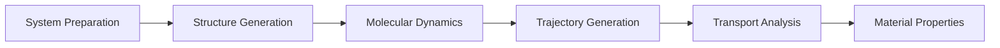

# Atomistic Simulation

🔬 ATOMISTIC SIMULATION

<h2>
From Atomic Structures to Material Properties
</h2>

<strong>Level:</strong> Beginner to Intermediate

<strong>Methods:</strong> Molecular Dynamics, DC-DFTB-MD

<strong>Focus:</strong> Atomic-scale Materials Simulation

## Overview

Atomistic simulation describes materials by modeling atomic structures and their interactions at the atomic scale.

This module introduces the complete workflow from initial structure preparation to molecular dynamics simulation and transport property analysis.

The workflow is designed for studying complex materials systems such as:

- Ionic liquid electrolytes
- Battery interfaces
- Solid-liquid systems
- Surface interaction systems

## Learning Workflow

## Module Structure

The module consists of several connected stages.

### 1. System Preparation

The first stage focuses on preparing physically meaningful atomic structures.

Topics:

- Molecular building
- Interface construction
- Simulation box preparation
- Structure validation

### 2. Molecular Dynamics Fundamentals

This stage introduces the principles of atomic movement simulation.

Topics:

- Newton's equations of motion
- Force calculation
- Time integration
- MD ensembles:

    - NVE
    - NVT
    - NPT

### 3. DC-DFTB-MD Workflow

This stage covers quantum-based molecular dynamics simulation.

Topics:

- Input preparation
- HPC execution
- Trajectory generation

### 4. Transport Analysis

The final stage extracts material properties from trajectory data.

Topics:

- Mean Square Displacement (MSD)
- Diffusion coefficient
- Radial Distribution Function (RDF)

## Software Stack

The workflow combines several computational tools:

| Tool | Function |
| --- | --- |
| Packmol | Molecular structure generation |
| DFTB+ | Quantum-based atomistic simulation |
| DC-DFTB-MD | Large-scale molecular dynamics |
| OVITO | Trajectory visualization |
| Python | Data analysis |

## Learning Outcomes

After completing this module, participants will be able to:

- Prepare atomic-scale simulation systems
- Understand molecular dynamics workflows
- Perform DC-DFTB-MD simulations
- Analyze molecular dynamics trajectory data
- Extract transport properties from molecular simulations
