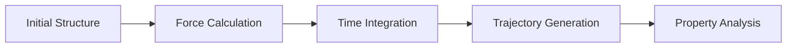
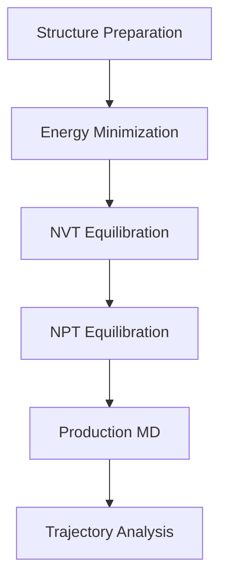
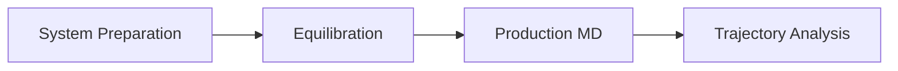

# Molecular Dynamics Fundamentals

## Overview

Molecular Dynamics (MD) is a computational method used to study the movement and interaction of atoms over time.

In MD simulation, atomic positions evolve according to Newton's equations of motion.

The simulation generates atomic trajectories that can be analyzed to understand structural, thermodynamic, and transport properties.

## Molecular Dynamics Concept

The basic workflow of molecular dynamics consists of:

## Components of Molecular Dynamics Simulation

### 1. Atomic Structure

The simulation starts from an initial atomic configuration.

Examples:

- Crystal structure
- Molecular system
- Liquid electrolyte
- Solid-liquid interface

### 2. Interaction Model

Atomic forces determine how atoms move during simulation.

Different approaches include:

- Classical force field
- Density Functional Tight Binding (DFTB)
- Machine learning potential

### 3. Time Integration

The position and velocity of atoms are updated at every timestep.

Common integration methods:

- Verlet algorithm
- Velocity Verlet algorithm

## Molecular Dynamics Ensembles

The ensemble defines which physical quantities remain constant during simulation.

In practical molecular dynamics workflows, different ensembles are used at different simulation stages.

A common approach is:

- NVT for temperature equilibration
- NPT for density and pressure equilibration
- Production MD for collecting trajectory data

### NVE Ensemble

#### Constant Number, Volume, and Energy

NVE simulation keeps:

- Number of atoms (N)
- Volume (V)
- Total energy (E)

constant.

Applications:

- Energy conservation studies
- Short production simulations

### NVT Ensemble

#### Constant Number, Volume, and Temperature

NVT simulation controls temperature using a thermostat.

Common thermostats:

- Nosé-Hoover thermostat
- Langevin thermostat

Applications:

- Temperature equilibration
- Battery electrolyte simulation

### NPT Ensemble

#### Constant Number, Pressure, and Temperature

NPT simulation controls pressure and temperature.

Applications:

- Density equilibration
- Liquid system preparation
- Interface relaxation

## Typical MD Workflow

## Production Molecular Dynamics

After equilibration, production MD is performed to collect trajectory data.

The trajectory contains information about:

- Atomic positions
- Atomic velocities
- Energy evolution
- Structural changes

The generated trajectory is used for further analysis such as:

- Diffusion coefficient calculation
- Radial Distribution Function (RDF)
- Mean Square Displacement (MSD)
## Software Examples

Different software packages can perform molecular dynamics simulations.

| Software | Application |
| --- | --- |
| DFTB+ | Quantum-based molecular dynamics |
| DC-DFTB-MD | Large-scale atomistic simulation |
| LAMMPS | Classical and advanced molecular dynamics |
| GROMACS | Molecular and biomolecular simulation |

## Connection to Research Cases

The molecular dynamics workflow can be applied to different materials systems.

Examples:

- Ionic liquid electrolyte
- Battery interfaces
- Surface reactions
- Liquid-solid interactions

## Summary

Molecular Dynamics provides a framework to understand atomic movement and material behavior.

The general workflow consists of:

