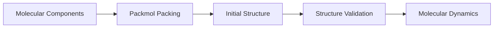

# Packmol


## Overview

Packmol is a molecular packing tool used to generate initial atomic configurations for molecular dynamics simulations.

It places molecules inside a defined simulation box while controlling molecular positions and avoiding unrealistic atomic overlap.

Packmol is commonly used for preparing complex molecular systems such as electrolytes, solvents, and liquid interfaces.


## Role of Packmol in Atomistic Simulation

Packmol is part of the system preparation stage.

The general workflow is:



## Input Components

A Packmol system requires several components before the packing process can be performed.


### 1. Molecular Structures

Individual molecular structures are prepared before packing.

Examples:

- Ionic liquid molecules
- Solvent molecules
- Salt molecules
- Additives


Common structure formats:

- XYZ
- PDB


### 2. Molecular Quantity

The number of molecules must represent the desired system composition.

Parameters include:

- Number of molecules
- Molecular ratio
- Concentration

### 3. Simulation Box

The simulation box defines the space where molecules are placed during the packing process.

Important parameters:

- Box dimensions
- Periodic boundary conditions
- Initial molecular distribution


## Packmol Workflow

The general workflow consists of several steps.


### Step 1: Prepare Molecular Structures

Each molecular component must have a valid initial structure before packing.

Checks:

- Correct atomic composition
- Reasonable geometry
- Appropriate file format


### Step 2: Create Packmol Input File

The input file defines the packing conditions.

The main parameters include:

- Molecule files
- Number of molecules
- Packing region
- Distance constraints

### Example Packmol Input File

A Packmol input file defines the molecular components, output structure, and packing constraints.

Example:

```text
tolerance 2.0

filetype xyz

output system.xyz

structure molecule_A.xyz

  number 100

  inside box 0. 0. 0. 50. 50. 50.

end structure

### Step 3: Generate Initial Configuration

Packmol creates the packed molecular structure.

The output structure should be visualized and checked before molecular dynamics simulation.


## Structure Validation After Packing

The generated structure should be validated before simulation.

Important checks:

- Atomic overlap
- Molecular distribution
- Density estimation
- Visualization


Common visualization tools:

- VESTA
- OVITO
- ASE


## Example Application: Ionic Liquid System

Packmol can be used to construct ionic liquid simulation boxes.

Example workflow:

```mermaid
flowchart TD

A[EMIM-TFSI Molecules]
-->B[Packmol]

B
-->C[Ionic Liquid Box]

C
-->D[MD Simulation]

## Connection to Molecular Dynamics

The final Packmol structure becomes the starting configuration for molecular dynamics simulation.

The generated structure can be used for:

- Energy minimization
- NVT equilibration
- NPT equilibration
- Production molecular dynamics
- Transport analysis


## Summary

Packmol provides an efficient approach for generating initial molecular configurations.

A reliable packing process ensures that the molecular dynamics simulation starts from a physically meaningful structure.
