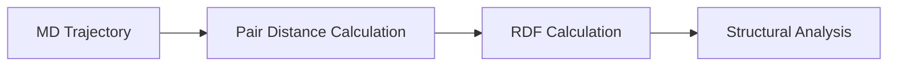

# Radial Distribution Function (RDF)

## Overview

Radial Distribution Function (RDF) is an analysis method used to describe the spatial distribution of atoms or molecules in a material system.

RDF shows the probability of finding a particle at a certain distance from another reference particle.

It provides information about local atomic and molecular structures.

## Role of RDF in Transport Analysis

While MSD describes particle movement, RDF describes the structural arrangement of particles during molecular dynamics simulation.

The workflow is:

## RDF Concept

RDF is commonly expressed as a function of distance between particles.

The RDF value indicates how particle density changes relative to an ideal distribution.

Important information obtained from RDF includes:

- Neighbor distance
- Coordination environment
- Local structural ordering

## RDF Interpretation

The RDF curve contains peaks representing preferred atomic distances.

General interpretation:

- First peak represents nearest neighbor interaction
- Peak position indicates bonding or coordination distance
- Peak intensity indicates interaction strength

## Applications

RDF analysis is commonly used for:

- Solvation structure analysis
- Ion coordination studies
- Electrolyte structure investigation
- Solid-liquid interface analysis

