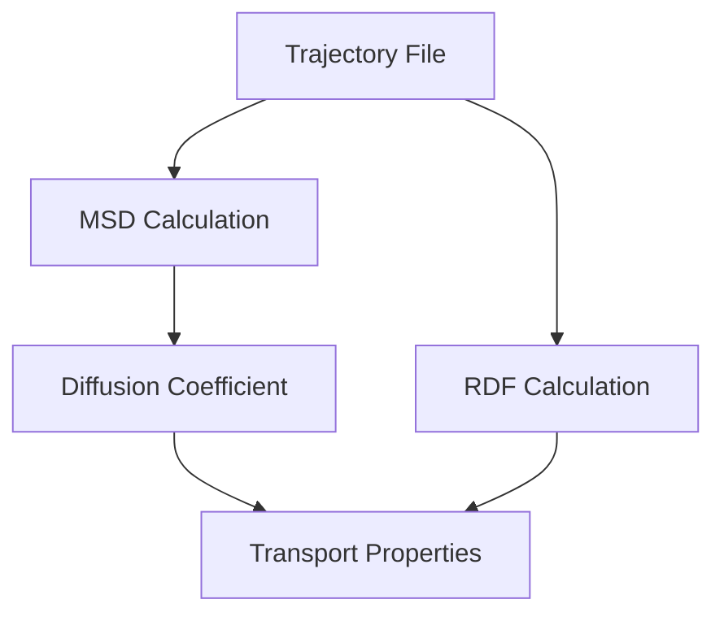

# Transport Analysis

## Overview

Transport analysis is the process of extracting physical properties from molecular dynamics trajectory data.

After the simulation generates atomic trajectories, the data can be analyzed to understand how atoms and molecules move inside the system.

This analysis is especially important for studying:

- Ion transport
- Molecular diffusion
- Liquid behavior
- Interface dynamics

## Role of Transport Analysis

Molecular dynamics produces time-dependent atomic configurations.

Transport analysis converts this trajectory information into measurable properties.

The general workflow is:

## Main Analysis Methods

### 1. Mean Square Displacement (MSD)

MSD describes how far atoms move from their initial positions during simulation.

It is commonly used to evaluate atomic mobility and diffusion behavior.

Applications:

- Ion movement analysis
- Molecular mobility
- Diffusion calculation

### 2. Diffusion Coefficient

The diffusion coefficient describes the rate at which particles move through a material system.

It is commonly calculated from the MSD result.

Applications:

- Electrolyte transport
- Ion conductivity studies
- Molecular diffusion analysis

### 3. Radial Distribution Function (RDF)

RDF describes the probability of finding particles at a certain distance from another particle.

It provides information about local atomic and molecular structure.

Applications:

- Solvation structure
- Ion coordination
- Interfacial interaction

## Analysis Workflow

The general transport analysis workflow is:

## Connection to Research Applications

Transport analysis can be applied to different materials systems.

Examples:

- Ionic liquid electrolytes
- Battery interfaces
- Solid-liquid systems
- Surface reaction environments

## Summary

Transport analysis provides a connection between molecular dynamics simulation and measurable material properties.

By analyzing trajectory data, researchers can understand atomic movement, diffusion behavior, and structural interactions.
