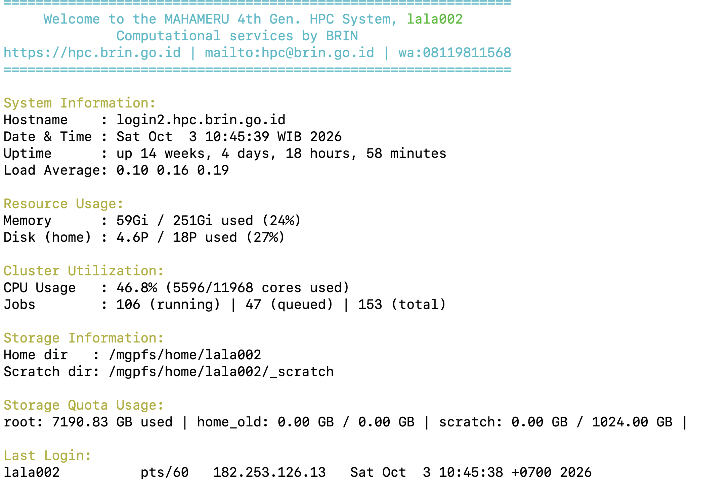

## Working on Mahameru

Setelah berhasil login, Anda akan berada di **login node Mahameru HPC BRIN**.  
Terminal akan menampilkan informasi singkat mengenai sistem, resource, storage, dan pekerjaan SLURM yang sedang berjalan.

Contoh informasi yang ditampilkan setelah berhasil login ke Mahameru HPC BRIN.

01

<strong>System</strong>

Hostname, waktu sistem, uptime, dan load average.

02

<strong>Resource</strong>

Penggunaan memory, disk, dan kapasitas komputasi.

03

<strong>Cluster</strong>

CPU usage serta jumlah job yang running dan queued.

04

<strong>Storage</strong>

Home directory, scratch directory, dan quota storage.

---

### Memahami Informasi Login Node

Informasi yang muncul di Terminal membantu Anda mengetahui kondisi lingkungan kerja sebelum menjalankan pekerjaan komputasi.

<strong>System Information</strong>

Bagian ini menunjukkan informasi dasar mengenai login node.

- **Hostname** menunjukkan server yang sedang digunakan.
- **Date & Time** menunjukkan waktu sistem.
- **Uptime** menunjukkan berapa lama server telah aktif.
- **Load Average** menunjukkan beban sistem.

Contoh:

`Hostname : login2.hpc.brin.go.id`

<strong>Resource Usage</strong>

Bagian ini menunjukkan penggunaan resource pada sistem.

- **Memory** menunjukkan penggunaan RAM.
- **Disk (home)** menunjukkan penggunaan storage pada home directory.

Gunakan informasi ini untuk memahami kondisi resource sebelum bekerja.

<strong>Cluster Utilization</strong>

Bagian ini memberikan gambaran penggunaan cluster.

Informasi yang ditampilkan meliputi:

- **CPU Usage**
- jumlah core yang digunakan
- jumlah job yang sedang **running**
- jumlah job yang sedang **queued**
- total job pada sistem

Contoh dari login node:

`CPU Usage : 46.8%`

`Jobs : 106 (running) | 47 (queued) | 153 (total)`

<strong>Storage Information</strong>

Mahameru menampilkan lokasi directory yang digunakan oleh akun.

**Home directory**

`/mgpfs/home/lala002`

**Scratch directory**

`/mgpfs/home/lala002/_scratch`

Scratch dapat digunakan sebagai area kerja sementara untuk pekerjaan komputasi.

<strong>Storage Quota</strong>

Bagian ini menunjukkan penggunaan quota storage.

Contoh:

`root : 7190.83 GB used`

`home_old : 0.00 GB / 0.00 GB`

`scratch : 0.00 GB / 1024.00 GB`

Periksa quota sebelum menjalankan pekerjaan yang menghasilkan file berukuran besar.

---

## Active SLURM Jobs

Jika Anda memiliki pekerjaan yang sedang berjalan, login node juga dapat menampilkan daftar **active SLURM jobs**.

Informasi penting yang perlu diperhatikan:

<strong>JOBID</strong>

Identitas pekerjaan.

<strong>PARTITION</strong>

Partition yang digunakan.

<strong>ST</strong>

Status pekerjaan.

<strong>TIME</strong>

Durasi pekerjaan.

<strong>NODES</strong>

Jumlah node yang digunakan.

<strong>NODELIST</strong>

Node tempat job berjalan.

### Contoh

`JOBID    PARTITION    NAME       USER    ST`

`552995   medium-1a    addition   lala002  R`

`554133   short        R0-W10.s   lala002  R`

`554134   short        R0-W30.s   lala002  R`

**Status `R` menunjukkan job sedang running.**

---

## Quick Check

Sebelum mulai menyiapkan pekerjaan komputasi, lakukan pengecekan sederhana:

01
<strong>Check location</strong>
<code>pwd</code>

02
<strong>Check files</strong>
<code>ls</code>

03
<strong>Check storage</strong>
<code>df -h</code>

04
<strong>Check jobs</strong>
<code>squeue</code>

---

<strong>💡 Yang perlu diingat</strong>

Login node digunakan untuk akses, persiapan pekerjaan, pengelolaan file,
dan pengiriman job. Pekerjaan komputasi sebaiknya dijalankan melalui
mekanisme <strong>SLURM</strong> sesuai resource dan partition yang tersedia.

---

## Next Step

Setelah memahami lingkungan kerja Mahameru, lanjutkan ke:

**03 · SLURM & Computing**

Di bagian berikutnya kita akan membahas bagaimana memilih partition,
menyiapkan resource, membuat job, mengirim pekerjaan, dan memantau statusnya.
