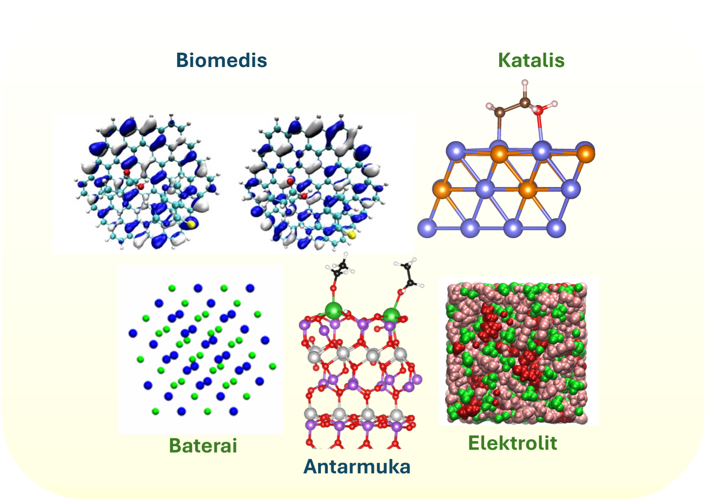

  <section class="day2-cover-wrap">
    
  </section>

  <section class="day2-hero">
    

      WORKSHOP PREMIUM · COMPUTATIONAL MATERIALS
    

    <h1 class="day2-main-title">
      Dari Atom ke Antarmuka
    </h1>

    

    

      Panduan workshop komputasi material yang menghubungkan struktur atom,
      dinamika molekul, DFTB+, dan pendekatan AI untuk studi material modern.
    

    

      

        TOPIK
        <strong>DFTB+ · Dinamika Molekul · AI</strong>
      

      

        WAKTU
        <strong>6–7 Oktober 2026</strong>
      

      

        LOKASI
        <strong>Labtek VI Lantai 2 · ITB</strong>
      

      

        NARASUMBER
        <strong>Dr. Aulia Sukma Hutama, S.Si., M.Si.</strong>
      

    

  </section>

  <section class="day2-section">

    

      

        01
      

      

        

          RUANG LINGKUP
        

        

        <h2>
          Dari sistem atomistik menuju aplikasi antarmuka
        </h2>

        

      

    

    

      <article class="day2-topic">

        

          01
        

        <h3>
          Biomedis
        </h3>

        

          Pemodelan struktur dan interaksi material untuk sistem
          biomaterial, permukaan, dan lingkungan biologis.
        

      </article>

      <article class="day2-topic day2-topic-soft">

        

          02
        

        <h3 class="green">
          Katalis
        </h3>

        

          Analisis adsorpsi, reaktivitas, dan stabilitas struktur
          pada permukaan katalitik.
        

      </article>

      <article class="day2-topic day2-topic-soft">

        

          03
        

        <h3 class="green">
          Baterai
        </h3>

        

          Kajian struktur kristal, migrasi ion, dan perubahan
          konfigurasi pada material penyimpan energi.
        

      </article>

      <article class="day2-topic">

        

          04
        

        <h3>
          Antarmuka
        </h3>

        

          Pemodelan batas dua fase, permukaan material, adsorbat,
          serta perubahan struktur pada tingkat atom.
        

      </article>

      <article class="day2-topic day2-topic-soft">

        

          05
        

        <h3 class="green">
          Elektrolit
        </h3>

        

          Simulasi dinamika dan struktur lokal untuk memahami
          koordinasi, transport, dan kestabilan elektrolit.
        

      </article>

    

  </section>

  <section class="day2-section">

    

      

        02
      

      

        

          ALUR WORKSHOP
        

        

        <h2>
          Struktur → Simulasi → Analisis
        </h2>

        

      

    

    

      

        

        

          <strong>
            Bangun Struktur
          </strong>

          

            Siapkan geometri atom, cell, dan konfigurasi sistem.
          

        

      

      

        

        

          <strong>
            Jalankan DFTB+
          </strong>

          

            Siapkan input, parameter, dan komputasi utama.
          

        

      

      

        

        

          <strong>
            Dinamika Molekul
          </strong>

          

            Pelajari evolusi struktur terhadap waktu dan temperatur.
          

        

      

      

        

        

          <strong>
            Analisis Hasil
          </strong>

          

            Ekstrak struktur, energi, trajectory, dan observabel penting.
          

        

      

      

        

        

          <strong>
            AI & Otomasi
          </strong>

          

            Gunakan workflow modern untuk mempercepat eksplorasi material.
          

        

      

    

  </section>

