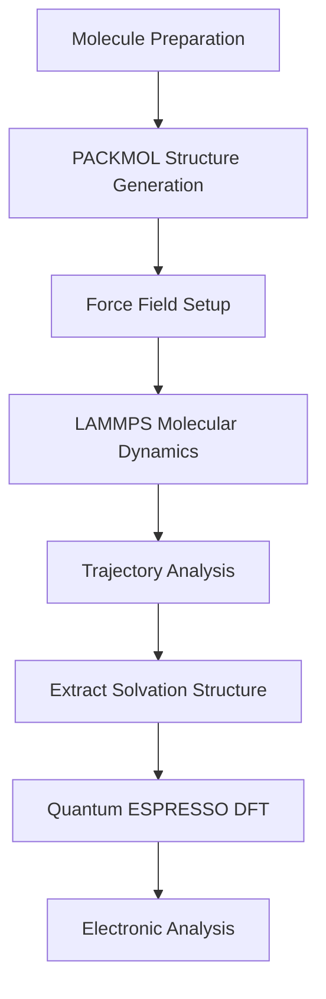

# 🔋 Lithium-Ion Battery Electrolyte Simulation


This hands-on case demonstrates atomistic simulation of
lithium-ion electrolyte systems using molecular dynamics
and first-principles calculations.


The workflow combines PACKMOL, LAMMPS, and Quantum ESPRESSO
to investigate Li⁺ solvation structures and electrolyte behavior.


<div class="grid cards" markdown>


- Material

    Lithium-ion electrolyte


- Method

    Molecular Dynamics + DFT


- Software

    PACKMOL, LAMMPS, Quantum ESPRESSO


- Analysis

    RDF, Coordination Number, DOS


</div>


---


# 🚀 Simulation Workflow





---


# ⚙️ Calculation Steps


## 1. System Preparation

Generate the initial electrolyte configuration using PACKMOL.


Input:

```text
packmol.inp
```


Output:

```text
structure.xyz
```


---


## 2. Molecular Dynamics Simulation


Perform electrolyte simulation using LAMMPS.


Input:

```text
in.lammps
```


Output:

```text
trajectory.lammpstrj
```


Analysis:

- Radial Distribution Function (RDF)
- Coordination Number
- Diffusion Analysis


---


## 3. Quantum ESPRESSO Analysis


Representative structures extracted from MD
are analyzed using Quantum ESPRESSO.


Workflow:

```text
Structure Relaxation

↓

SCF Calculation

↓

DOS Analysis
```


---


# 📓 Analysis Notebook


Python notebook for RDF, trajectory,
and electronic structure analysis.


[Open Battery Electrolyte Analysis Notebook](analysis/battery_analysis.ipynb)


---


# 📂 Simulation Files


| File | Category | Description | Download |
|---|---|---|---|
| packmol.inp | Structure Generation | PACKMOL configuration file | Download |
| in.lammps | MD Input | LAMMPS simulation input | Download |
| relax.in | QE Input | Geometry optimization | Download |
| scf.in | QE Input | Electronic calculation | Download |
| dos.in | QE Input | Density of states calculation | Download |
| submit_lammps.sh | HPC Script | LAMMPS submission script | Download |
| submit_qe.sh | HPC Script | QE submission script | Download |
| battery_analysis.ipynb | Analysis | Python visualization | Download |

