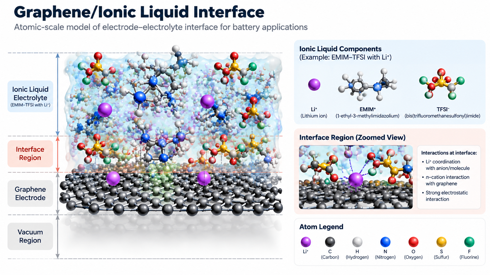
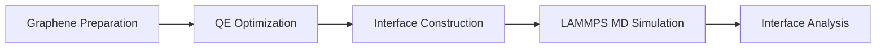

# 🔋 Graphene/Ionic Liquid Interface Simulation


!!! abstract "Case Overview"

    This hands-on case extends the previous graphene electronic
    structure study into an electrode-electrolyte interface system.

    In this case, graphene is used as a model electrode surface,
    while ionic liquid is introduced as an electrolyte environment.
    The system is constructed and analyzed using Quantum ESPRESSO,
    PACKMOL, and LAMMPS.



<p align="center">
<em>
Atomic-scale representation of graphene electrode and ionic liquid
electrolyte interface used in molecular simulation.
</em>
</p>

<div class="grid cards" markdown>


- **Material**

    Graphene Electrode  
    +  
    Ionic Liquid Electrolyte


- **Method**

    Density Functional Theory  
    +  
    Molecular Dynamics


- **Software**

    Quantum ESPRESSO  
    PACKMOL  
    LAMMPS


- **Analysis**

    RDF  
    Density Profile  
    Ion Distribution


</div>

## 🔬 Research Question


This simulation investigates how ionic liquid species organize and
interact near a graphene electrode surface.


The main questions explored are:


- How are ions distributed near the graphene surface?
- How do electrolyte molecules interact with the electrode?
- How does the interface structure evolve during molecular dynamics?

## 🎯 Learning Objectives


After completing this case, participants will be able to:


<div class="grid cards" markdown>


- **Understand**

    Electrode-electrolyte interface modeling


- **Construct**

    Graphene and ionic liquid interface systems


- **Simulate**

    Atomic behavior using molecular dynamics


- **Analyze**

    Structural properties of the interface


</div>


## 🧩 System Overview


The simulated system represents the interaction between a graphene
electrode surface and ionic liquid electrolyte.


```text
        Ionic Liquid Electrolyte

       Li+     Cation     Anion


--------------------------------


          Graphene Electrode


--------------------------------


          Vacuum Region
```


The system consists of:


| Component | Role |
|---|---|
| Graphene | Model electrode surface |
| Ionic Liquid | Electrolyte environment |
| Interface Region | Electrode-electrolyte interaction zone |


The graphene structure obtained from the previous electronic structure
case is reused as the foundation for this interface simulation.


## 🚀 Simulation Workflow


The simulation follows a multi-stage workflow combining
first-principles calculations and molecular dynamics.





## ⚙️ Simulation Procedure


### Step 1. Graphene Electrode Preparation


The optimized graphene structure from the previous case is used as
the electrode model.


Quantum ESPRESSO is applied to obtain a stable graphene structure
before introducing the electrolyte system.


```text
Graphene Structure

↓

Quantum ESPRESSO Relaxation

↓

Optimized Graphene Surface
```


Output:

```text
optimized_graphene.xyz
```


---


### Step 2. Ionic Liquid Interface Construction


The ionic liquid electrolyte is placed above the graphene surface
to create the initial electrode-electrolyte interface.


PACKMOL is used to generate the initial atomic configuration.


```text
Graphene Surface

+

Ionic Liquid Molecules

↓

PACKMOL

↓

Interface Structure
```


Input:

```text
packmol.inp
```


Output:

```text
interface.xyz
```


---


### Step 3. Molecular Dynamics Simulation


The generated interface structure is simulated using LAMMPS
to observe atomic movement and structural evolution.


```text
Energy Minimization

↓

Equilibration

↓

Production Molecular Dynamics
```


Output:

```text
trajectory.lammpstrj
```


---


### Step 4. Interface Analysis


The molecular dynamics trajectory is analyzed to understand
electrolyte behavior near the graphene surface.


| Analysis | Purpose |
|---|---|
| Density Profile | Spatial distribution of electrolyte species |
| RDF | Interaction between graphene and ionic species |
| Coordination Number | Local atomic environment |
| Diffusion Analysis | Ion mobility behavior |


## 📊 Simulation Outputs


The simulation provides several properties to understand
the electrode-electrolyte interface.


| Output | Description | Tool |
|---|---|---|
| Interface Structure | Atomic arrangement of graphene and electrolyte | OVITO |
| Density Profile | Ion distribution near surface | Python |
| RDF | Atomic interaction analysis | Python |
| Diffusion | Ion transport behavior | Python |
| Electronic Structure | Graphene properties | Quantum ESPRESSO |


## 🖥️ Computational Tools


| Software | Main Role |
|---|---|
| Quantum ESPRESSO | Graphene optimization and electronic calculation |
| PACKMOL | Interface structure generation |
| LAMMPS | Molecular dynamics simulation |
| OVITO | Atomic visualization |
| Python | Data processing and visualization |

## 📥 Quick Access


Download the main simulation resources:


<a class="md-button md-button--primary" href="qe/scf.in">
Download QE Files
</a>


<a class="md-button md-button--primary" href="lammps/in.lammps">
Download LAMMPS Files
</a>


<a class="md-button md-button--primary" href="analysis/interface_analysis.ipynb">
Download Analysis Notebook
</a>

## 📈 Expected Results


After completing this workflow, participants will obtain
simulation data that describes the behavior of the graphene-electrolyte
interface.


| Result | Description | Analysis Tool |
|---|---|---|
| Optimized graphene structure | Stable electrode surface after relaxation | Quantum ESPRESSO |
| Interface configuration | Initial graphene and ionic liquid arrangement | PACKMOL |
| MD trajectory | Atomic movement during simulation | LAMMPS |
| Density profile | Distribution of ions near graphene surface | Python |
| RDF curve | Interaction between graphene and electrolyte species | Python |
| Diffusion behavior | Ion mobility information | Python |

## 📓 Analysis Notebook


The simulation trajectory and interface properties are analyzed
using Python.


The notebook includes:


- Trajectory visualization
- Density profile calculation
- Radial Distribution Function (RDF)
- Interface structure analysis


Download:

[Interface Analysis Notebook](analysis/interface_analysis.ipynb)


## 📂 Simulation Files


Download the required files for the graphene/ionic liquid
interface workflow.


| File | Category | Description | Download |
|---|---|---|---|
| `graphene_surface.in` | QE Input | Graphene optimization input | [Download](qe/graphene_surface.in) |
| `scf.in` | QE Input | Electronic structure calculation | [Download](qe/scf.in) |
| `pseudo/` | QE Resource | Quantum ESPRESSO pseudopotential files | [Download](qe/pseudo/) |
| `packmol.inp` | Structure Generation | Ionic liquid packing input | [Download](packmol/packmol.inp) |
| `interface.xyz` | Structure File | Initial interface configuration | [Download](packmol/interface.xyz) |
| `data.interface` | MD Structure | LAMMPS interface structure | [Download](lammps/data.interface) |
| `in.lammps` | MD Input | Molecular dynamics input | [Download](lammps/in.lammps) |
| `submit_qe.sh` | HPC Script | Quantum ESPRESSO submission | [Download](scripts/submit_qe.sh) |
| `submit_lammps.sh` | HPC Script | LAMMPS submission | [Download](scripts/submit_lammps.sh) |
| `interface_analysis.ipynb` | Analysis | Python analysis notebook | [Download](analysis/interface_analysis.ipynb) |


## 🔗 Connection with Graphene Electronic Structure Case


This case extends the previous graphene simulation by transforming
the optimized graphene structure into a realistic electrode-electrolyte
interface model.


```text
Graphene Electronic Structure

Quantum ESPRESSO

↓

Graphene/Ionic Liquid Interface

Quantum ESPRESSO
+
PACKMOL
+
LAMMPS
```
