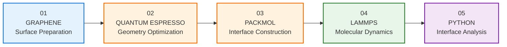
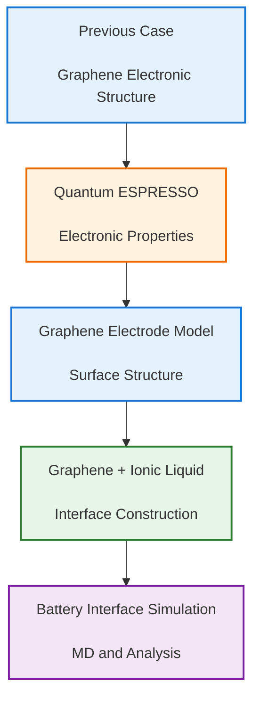

# 🔋 Graphene/Ionic Liquid Interface Simulation


<span class="section-label">CASE OVERVIEW</span>


!!! abstract "Case Overview"

    This hands-on case extends the previous graphene electronic
    structure study into an electrode-electrolyte interface system.

    Graphene is used as a model electrode surface, while ionic liquid
    is introduced as an electrolyte environment.


<p align="center">
<em>
Atomic-scale representation of graphene electrode and ionic liquid
electrolyte interface used in molecular simulation.
</em>
</p>

<div class="grid cards" markdown>

- **Material**

    Graphene Electrode  
    +  
    Ionic Liquid Electrolyte


- **Method**

    Density Functional Theory  
    +  
    Molecular Dynamics


- **Software**

    Quantum ESPRESSO  
    PACKMOL  
    LAMMPS


- **Analysis**

    RDF  
    Density Profile  
    Ion Distribution


</div>

<span class="section-label">SCIENTIFIC MOTIVATION</span>

## 🔬 Research Question


This simulation investigates how ionic liquid species organize and
interact near a graphene electrode surface.


The main questions explored are:


- How are ions distributed near the graphene surface?
- How do electrolyte molecules interact with the electrode?
- How does the interface structure evolve during molecular dynamics?

<span class="section-label">LEARNING GOALS</span>

## 🎯 Learning Objectives


After completing this case, participants will understand the complete
workflow of graphene-based electrode-electrolyte interface simulation.


The participants will learn how to:


| Objective | Description |
|---|---|
| Model | Understand graphene as an electrode surface model |
| Construct | Build graphene and ionic liquid interface structures |
| Simulate | Perform molecular dynamics simulation of the interface |
| Analyze | Extract structural properties from simulation results |

<span class="section-label">MODEL DESCRIPTION</span>

## 🧩 System Overview

The simulated system represents an electrode-electrolyte interface,
where ionic liquid molecules interact with a graphene electrode surface.


The model consists of three main regions:


```text
        Ionic Liquid Electrolyte Layer

          Li+     Cation     Anion


======================================

            Interface Region

      Ion arrangement and interaction


======================================

            Graphene Electrode

          Carbon atom layers


======================================

              Vacuum Layer
```


| Region | Description |
|---|---|
| Ionic Liquid Layer | Electrolyte molecules surrounding the electrode |
| Interface Region | Area where ion-electrode interactions occur |
| Graphene Electrode | Conductive surface model for battery electrode |
| Vacuum Layer | Space used for surface simulation boundary |


The graphene structure from the previous electronic structure case
is reused as the electrode foundation before introducing the ionic
liquid electrolyte.

<span class="section-label">SIMULATION DESIGN</span>

## 🚀 Simulation Workflow


The simulation workflow connects material preparation,

interface construction, molecular dynamics simulation,

and data analysis into a complete computational pipeline.



```mermaid
flowchart LR

A["01<br>GRAPHENE<br>Surface Preparation"]

B["02<br>QUANTUM ESPRESSO<br>Geometry Optimization"]

C["03<br>PACKMOL<br>Interface Construction"]

D["04<br>LAMMPS<br>Molecular Dynamics"]

E["05<br>PYTHON<br>Interface Analysis"]


A --> B
B --> C
C --> D
D --> E


classDef graphene fill:#e3f2fd,stroke:#1976d2,stroke-width:2px;

classDef qe fill:#fff3e0,stroke:#ef6c00,stroke-width:2px;

classDef md fill:#e8f5e9,stroke:#2e7d32,stroke-width:2px;

classDef analysis fill:#f3e5f5,stroke:#7b1fa2,stroke-width:2px;


class A graphene;
class B qe;
class C qe;
class D md;
class E analysis;

```

| Stage | Main Activity | Output |
|---|---|---|
| 01 | Prepare graphene electrode structure | Graphene model |
| 02 | Optimize graphene geometry using QE | Stable surface structure |
| 03 | Add ionic liquid electrolyte using PACKMOL | Interface configuration |
| 04 | Simulate atomic evolution using LAMMPS | MD trajectory |
| 05 | Analyze interface properties | Structural information |

<span class="section-label">COMPUTATIONAL METHOD</span>

## ⚙️ Simulation Procedure


The complete simulation workflow consists of four computational
stages, starting from electrode preparation to interface property
analysis.


---

### 🔹 Stage 01 — Graphene Electrode Preparation


<span class="section-label">OBJECTIVE</span>

Prepare a stable graphene surface model as the electrode foundation.


<span class="section-label">INPUT</span>

```text
Graphene atomic structure
Quantum ESPRESSO parameters
Pseudopotential file
```


<span class="section-label">PROCESS</span>

```text
Initial graphene structure

        ↓

Quantum ESPRESSO relaxation

        ↓

Optimized graphene surface
```


<span class="section-label">OUTPUT</span>

```text
optimized_graphene structure
```


---

### 🔹 Stage 02 — Ionic Liquid Interface Construction


<span class="section-label">OBJECTIVE</span>

Generate an initial electrode-electrolyte interface configuration.


<span class="section-label">INPUT</span>

```text
Optimized graphene surface

+

Ionic liquid molecules
```


<span class="section-label">PROCESS</span>

```text
Graphene surface

        +

Ionic liquid molecules

        ↓

PACKMOL structure generation

        ↓

Interface configuration
```


<span class="section-label">OUTPUT</span>

```text
interface.xyz
```


---

### 🔹 Stage 03 — Molecular Dynamics Simulation


<span class="section-label">OBJECTIVE</span>

Observe atomic movement and structural evolution
of the graphene-electrolyte interface.


<span class="section-label">INPUT</span>

```text
Interface structure

LAMMPS parameter files
```


<span class="section-label">PROCESS</span>

```text
Energy minimization

        ↓

Equilibration

        ↓

Production molecular dynamics
```


<span class="section-label">OUTPUT</span>

```text
trajectory.lammpstrj
```


---

### 🔹 Stage 04 — Interface Analysis


<span class="section-label">OBJECTIVE</span>

Extract structural and dynamic properties
from molecular dynamics results.


<span class="section-label">ANALYSIS</span>

| Property | Method |
|---|---|
| Ion distribution | Density profile |
| Molecular interaction | RDF |
| Local coordination | Coordination number |
| Ion mobility | MSD / Diffusion coefficient |


<span class="section-label">OUTPUT</span>

```text
Interface structural properties
```

---

<span class="section-label">EXPECTED RESULTS</span>

## 📊 Simulation Outputs


The simulation produces structural, dynamic, and interfacial
properties to understand the behavior of the graphene-electrolyte
interface at the atomic scale.


<div class="grid cards" markdown>


- **🧱 Structural Information**

    Atomic configuration of graphene
    and ionic liquid interface.

    **Generated from**

    - PACKMOL
    - LAMMPS trajectory
    - OVITO visualization


- **🌊 Ion Distribution**

    Spatial arrangement of ions
    near graphene surface.

    **Analysis**

    - Density profile
    - Concentration distribution


- **🔗 Molecular Interaction**

    Interaction between graphene
    and electrolyte species.

    **Analysis**

    - Radial Distribution Function (RDF)
    - Coordination Number


- **⚡ Ion Transport**

    Dynamic behavior of ionic species
    during molecular dynamics.

    **Analysis**

    - Mean Square Displacement (MSD)
    - Diffusion coefficient


</div>


## 🖥️ Computational Tools


| Software | Main Role |
|---|---|
| Quantum ESPRESSO | Graphene optimization and electronic calculation |
| PACKMOL | Interface structure generation |
| LAMMPS | Molecular dynamics simulation |
| OVITO | Atomic visualization |
| Python | Data processing and visualization |

<div class="grid cards" markdown>

- **Quantum ESPRESSO**

    Graphene optimization  
    and electronic structure input

    <a class="md-button md-button--primary" href="qe/scf.in">
    Download QE
    </a>


- **LAMMPS**

    Molecular dynamics  
    interface simulation input

    <a class="md-button md-button--primary" href="lammps/in.lammps">
    Download LAMMPS
    </a>


- **Python Analysis**

    Interface analysis  
    and visualization notebook

    <a class="md-button md-button--primary" href="analysis/interface_analysis.ipynb">
    Download Notebook
    </a>

</div>
## 📈 Expected Results


After completing this workflow, participants will obtain
simulation data that describes the behavior of the graphene-electrolyte
interface.


| Result | Description | Analysis Tool |
|---|---|---|
| Optimized graphene structure | Stable electrode surface after relaxation | Quantum ESPRESSO |
| Interface configuration | Initial graphene and ionic liquid arrangement | PACKMOL |
| MD trajectory | Atomic movement during simulation | LAMMPS |
| Density profile | Distribution of ions near graphene surface | Python |
| RDF curve | Interaction between graphene and electrolyte species | Python |
| Diffusion behavior | Ion mobility information | Python |

<span class="section-label">DATA ANALYSIS</span>

## 📓 Analysis Notebook


The simulation trajectory and interface properties are analyzed
using Python.


The notebook includes:


- Trajectory visualization
- Density profile calculation
- Radial Distribution Function (RDF)
- Interface structure analysis


Download:

[Interface Analysis Notebook](analysis/interface_analysis.ipynb)

<span class="section-label">RESOURCES</span>

## 📂 Simulation Files


The repository contains all input files required to reproduce
the graphene/ionic liquid interface simulation workflow.


```text
graphene-ionic-liquid-interface/

├── qe/
│   ├── graphene_surface.in
│   │   Graphene geometry optimization input
│   │
│   ├── scf.in
│   │   Electronic structure calculation
│   │
│   └── pseudo/
│       Quantum ESPRESSO pseudopotential files
│
├── packmol/
│   ├── packmol.inp
│   │   Interface construction parameters
│   │
│   └── interface.xyz
│       Initial graphene-electrolyte structure
│
├── lammps/
│   ├── data.interface
│   │   Atomic configuration for MD
│   │
│   └── in.lammps
│       Molecular dynamics input
│
├── scripts/
│   ├── submit_qe.sh
│   │   HPC submission script for QE
│   │
│   └── submit_lammps.sh
│       HPC submission script for LAMMPS
│
└── analysis/
    └── interface_analysis.ipynb
        Python-based interface analysis
```


### Download Resources


<div class="grid cards" markdown>


- **Quantum ESPRESSO**

    Graphene optimization  
    and electronic calculation files.

    <a class="md-button md-button--primary" href="qe/scf.in">
    Download QE Input
    </a>


- **PACKMOL**

    Interface construction  
    configuration files.

    <a class="md-button md-button--primary" href="packmol/packmol.inp">
    Download PACKMOL
    </a>


- **LAMMPS**

    Molecular dynamics  
    simulation files.

    <a class="md-button md-button--primary" href="lammps/in.lammps">
    Download LAMMPS
    </a>


- **Analysis Notebook**

    Python workflow for  
    interface analysis.

    <a class="md-button md-button--primary" href="analysis/interface_analysis.ipynb">
    Download Notebook
    </a>


</div>
<span class="section-label">PREVIOUS CASE CONNECTION</span>

## 🔗 Connection with Graphene Electronic Structure Case


This case extends the previous graphene electronic structure
simulation by transforming an isolated graphene model into a
realistic electrode-electrolyte interface system.


The computational progression follows:



```mermaid
flowchart TD

A["Previous Case<br><br>Graphene Electronic Structure"]

B["Quantum ESPRESSO<br><br>Electronic Properties"]

C["Graphene Electrode Model<br><br>Surface Structure"]

D["Graphene + Ionic Liquid<br><br>Interface Construction"]

E["Battery Interface Simulation<br><br>MD and Analysis"]


A --> B
B --> C
C --> D
D --> E


classDef previous fill:#e3f2fd,stroke:#1976d2,stroke-width:2px;
classDef qe fill:#fff3e0,stroke:#ef6c00,stroke-width:2px;
classDef interface fill:#e8f5e9,stroke:#2e7d32,stroke-width:2px;
classDef final fill:#f3e5f5,stroke:#7b1fa2,stroke-width:2px;


class A previous;
class B qe;
class C previous;
class D interface;
class E final;

```


The relationship between both cases can be summarized as:


| Previous Graphene Case | Graphene/Ionic Liquid Interface Case |
|---|---|
| Study graphene electronic properties | Study electrode-electrolyte interactions |
| Single material system | Multicomponent interface system |
| Quantum ESPRESSO calculation | QE + PACKMOL + LAMMPS workflow |
| Atomic structure analysis | Interface dynamics and ion behavior |
