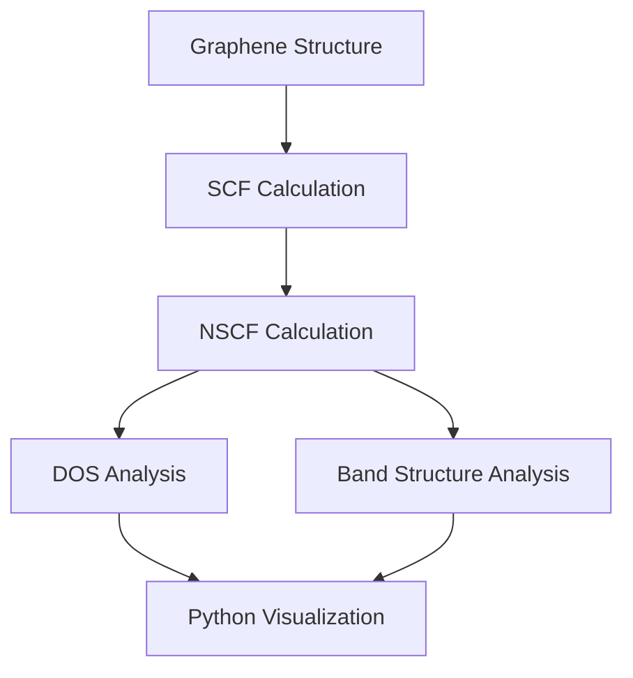

# 🧪 Electronic Structure of Graphene


Graphene is a two-dimensional carbon material used as a
benchmark system for electronic structure simulation.

This hands-on case demonstrates Density Functional Theory (DFT)
calculation using Quantum ESPRESSO on HPC.


<div class="grid cards" markdown>


- ⚛️ **Material**

    Graphene


- 🧮 **Method**

    DFT


- 💻 **Software**

    Quantum ESPRESSO


- 📊 **Analysis**

    DOS & Band Structure


</div>


---

# 🚀 Calculation Workflow


The graphene electronic structure calculation follows a
complete first-principles workflow:




---

## Pseudopotential


This case uses carbon pseudopotential provided in the HPC environment.


```text
C.pbe-n-kjpaw_psl.1.0.0.UPF
```
---

The pseudopotential file is automatically available
through the HPC environment and does not require
manual upload.


## ⚙️ Calculation Steps


## 1. SCF Calculation


The SCF calculation is performed to obtain the
converged electronic density of graphene.


**Input file**

```text
graphene_scf.in
```


**Run calculation**

```bash
bash scripts/submit_qe.sh graphene_scf
```


**Output**

```text
output/graphene_scf.out
```


Check calculation completion:


```bash
grep "JOB DONE" output/graphene_scf.out
```


---


## 2. NSCF Calculation


The NSCF calculation generates electronic states
using denser k-point sampling.


**Input file**

```text
graphene_nscf.in
```


**Run calculation**

```bash
bash scripts/submit_qe.sh graphene_nscf
```


**Output**

```text
output/graphene_nscf.out
```


---


## 3. DOS Analysis


The Density of States (DOS) calculation analyzes
the distribution of electronic states.


**Run calculation**

```bash
bash scripts/submit_post.sh graphene_dos dos.x
```


**Output**

```text
output/graphene_dos.dat
```


---


## 4. Band Structure Analysis


The electronic band structure is calculated along
the high-symmetry path:


```text
Γ → K → M → Γ
```


**Run calculation**

```bash
bash scripts/submit_qe.sh graphene_bands
```


**Post-processing**

```bash
bash scripts/submit_post.sh graphene_bands_pp bands.x
```


**Output**

```text
output/graphene_bands.dat.gnu
```


---
<div class="compact-table" markdown>
## ▶ Execution Summary


Run the calculations in the following order:


| Step | Command | Output |
|---|---|---|
| SCF | `bash scripts/submit_qe.sh graphene_scf` | `graphene_scf.out` |
| NSCF | `bash scripts/submit_qe.sh graphene_nscf` | `graphene_nscf.out` |
| DOS | `bash scripts/submit_post.sh graphene_dos dos.x` | `graphene_dos.dat` |
| Band Structure | `bash scripts/submit_qe.sh graphene_bands` | `graphene_bands.dat.gnu` |


---

## 📓 Python Analysis


The simulation results are visualized using Python
to analyze Density of States (DOS) and band structure.


Open the analysis notebook:


[📓 Graphene Analysis Notebook](analysis/graphene_analysis.ipynb)


---
## 📂 Simulation Files


Download the required files for the graphene electronic structure workflow.


| File | Category | Description | Download |
|---|---|---|---|
| `graphene_scf.in` | Input File | SCF calculation input for electronic density convergence | [Download](input/graphene_scf.in) |
| `graphene_nscf.in` | Input File | NSCF calculation input for electronic state generation | [Download](input/graphene_nscf.in) |
| `graphene_dos.in` | Input File | Input file for Density of States calculation | [Download](input/graphene_dos.in) |
| `graphene_bands.in` | Input File | Input file for band structure calculation | [Download](input/graphene_bands.in) |
| `graphene_bands_pp.in` | Input File | Post-processing input for band analysis | [Download](input/graphene_bands_pp.in) |
| `submit_qe.sh` | HPC Script | Slurm script for Quantum ESPRESSO submission | [Download](scripts/submit_qe.sh) |
| `submit_post.sh` | HPC Script | Slurm script for post-processing calculation | [Download](scripts/submit_post.sh) |
| `graphene_analysis.ipynb` | Analysis | Python notebook for visualization and data analysis | [Download](analysis/graphene_analysis.ipynb) |

---

## Next Step

Continue with Python analysis:

[📓 Open Graphene Analysis Notebook](analysis/graphene_analysis.ipynb)
