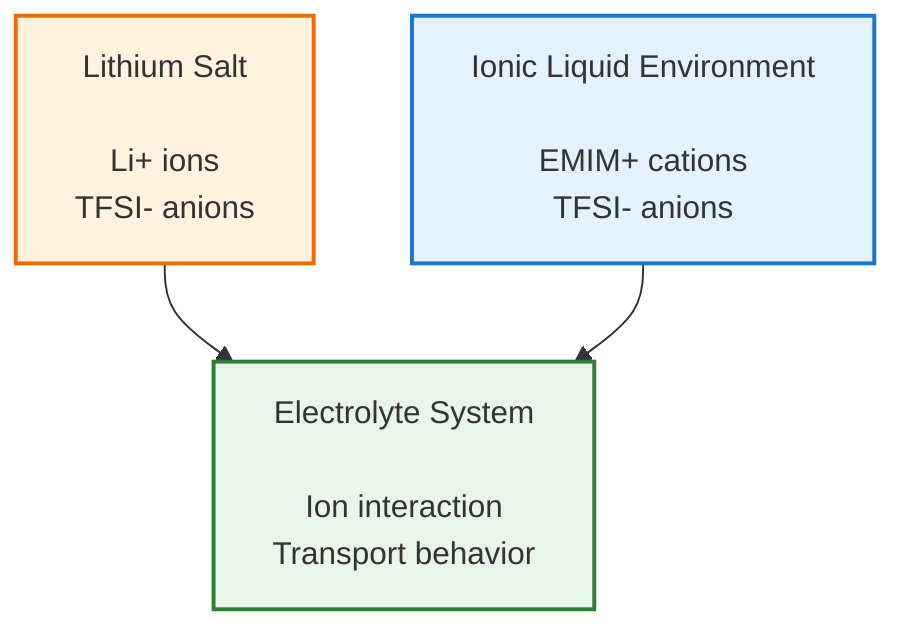
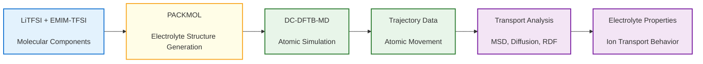
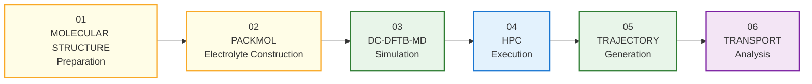
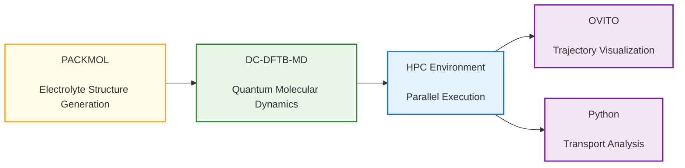
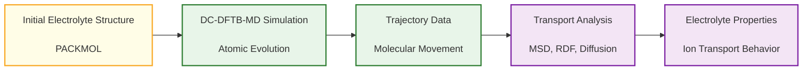

<span class="section-label">COMPUTATIONAL MATERIALS CASE STUDY</span>


# 🔋 LiTFSI-EMIM TFSI Ionic Liquid Electrolyte Transport


<div class="badge-container">

<span class="badge">DC-DFTB-MD</span>
<span class="badge">MOLECULAR DYNAMICS</span>
<span class="badge">PACKMOL</span>
<span class="badge">HPC</span>
<span class="badge">TRANSPORT ANALYSIS</span>

</div>


<div class="hero-description">

Atomistic simulation of LiTFSI-EMIM TFSI ionic liquid electrolyte
to investigate lithium ion mobility, molecular organization,
and transport properties using DC-DFTB-MD.

</div>


<span class="section-label">CASE OVERVIEW</span>


!!! abstract "Case Overview"

    This hands-on case demonstrates the complete workflow
    of lithium-based ionic liquid electrolyte simulation.

    LiTFSI salt dissolved in EMIM-TFSI ionic liquid is used
    as a model electrolyte system to study ion transport behavior
    at the atomic scale.

    The workflow combines molecular structure preparation,
    PACKMOL system generation, DC-DFTB-MD simulation,
    HPC execution, and trajectory-based transport analysis.


<div class="grid cards" markdown>


- **🧱 Material System**

    **LiTFSI Salt**

    Lithium salt component
    responsible for lithium ion transport.

    **EMIM-TFSI Ionic Liquid**

    Electrolyte environment
    for ion interaction and mobility study.


- **🧮 Computational Method**

    **DC-DFTB-MD**

    Quantum-based molecular dynamics
    for atomic-scale simulation.

    **Transport Analysis**

    MSD, diffusion coefficient,
    and RDF calculation.


- **💻 Simulation Tools**

    **PACKMOL**

    Initial electrolyte structure generation.

    **DC-DFTB-MD**

    Molecular dynamics simulation.

    **HPC Environment**

    Large-scale simulation execution.


- **📈 Analysis**

    **Structural**

    RDF and ion coordination analysis.

    **Dynamic**

    MSD and lithium ion diffusion analysis.


</div>
<span class="section-label">SCIENTIFIC MOTIVATION</span>


## 🔬 Research Question


This simulation investigates how lithium ions and ionic liquid
components organize and move at the atomic scale.


The main questions explored are:


- How does lithium ion transport occur inside the ionic liquid electrolyte?
- How do Li+, EMIM+, and TFSI- species interact during molecular dynamics simulation?
- How does the electrolyte structure influence ion mobility and transport properties?


<span class="section-label">LEARNING GOALS</span>


## 🎯 Learning Objectives


After completing this case, participants will understand the complete
workflow of ionic liquid electrolyte simulation using DC-DFTB-MD.


The participants will learn how to:


| Objective | Description |
|---|---|
| Prepare | Build LiTFSI-EMIM TFSI electrolyte simulation systems |
| Construct | Generate molecular configurations using PACKMOL |
| Simulate | Perform DC-DFTB-MD molecular dynamics simulation |
| Analyze | Extract transport properties from trajectory data |


<span class="section-label">MODEL DESCRIPTION</span>


## 🧩 System Overview


The simulated system represents a lithium-based ionic liquid
electrolyte environment consisting of LiTFSI salt dissolved
in EMIM-TFSI ionic liquid.


The model consists of three main components:




| Component | Physical Role | Simulation Purpose |
|---|---|---|
| Li+ Ion | Lithium charge carrier | Determines lithium ion mobility |
| TFSI- Anion | Counter ion species | Controls ionic interaction and coordination |
| EMIM+ Cation | Ionic liquid component | Provides electrolyte environment |
| Liquid Electrolyte System | Bulk simulation environment | Represents battery electrolyte behavior |

<span class="section-label">SIMULATION DESIGN</span>


<span class="section-label">RESEARCH PIPELINE</span>


## 🧭 Research Pipeline Overview


The research pipeline illustrates the transformation of molecular
components into a complete atomistic simulation workflow for
ionic liquid electrolyte transport analysis.



## 🚀 Simulation Workflow

The simulation workflow connects molecular preparation,  
quantum-based molecular dynamics simulation, and transport  
property analysis into a complete computational pipeline.




| Stage | Main Activity | Output |
|---|---|---|
| 01 | Prepare LiTFSI and EMIM-TFSI molecular structures | Molecular models |
| 02 | Generate electrolyte configuration using PACKMOL | Initial electrolyte system |
| 03 | Perform DC-DFTB-MD simulation | Atomic trajectory |
| 04 | Execute simulation using HPC resources | Simulation results |
| 05 | Store atomic movement data | Trajectory files |
| 06 | Calculate transport properties | Diffusion and structural information |

<span class="section-label">COMPUTATIONAL METHOD</span>


<span class="section-label">SIMULATION PROTOCOL</span>


## ⚙️ DC-DFTB-MD Simulation Procedure


The simulation is performed through several computational stages,
starting from electrolyte structure preparation to transport
property analysis.


---


### Stage 01 — Ionic Liquid Structure Preparation


**Purpose**

Prepare molecular structures of LiTFSI and EMIM-TFSI
as initial components for electrolyte simulation.


**Input**

    LiTFSI molecular structure

    +

    EMIM-TFSI molecular structure

    +

    DC-DFTB-MD parameter files


**Computational Process**

    Molecular components

            ↓

    Geometry preparation

            ↓

    Initial electrolyte structures


**Output**

    Prepared molecular structures
---

### Stage 02 — Electrolyte System Construction


**Purpose**

Generate the initial LiTFSI-EMIM TFSI electrolyte configuration
with proper molecular composition and spatial distribution
before molecular dynamics simulation.


**Input**

    LiTFSI molecular structure

    +

    EMIM-TFSI molecular structure

    +

    Packmol input configuration


**Computational Process**

    Molecular components

            ↓

    Molecular packing using PACKMOL

            ↓

    Periodic electrolyte simulation box


**Packmol Configuration**

The Packmol input defines the molecular composition,
number of molecules, and simulation box dimensions.

Important parameters include:

- Molecular quantity
- Molecular ratio
- Packing region
- Minimum atomic distance


**Example Application**

The electrolyte system is generated by combining:

- Li+ ions
- TFSI- anions
- EMIM+ cations


**Output**

    electrolyte_system.xyz


The generated structure is used as the initial configuration
for DC-DFTB-MD simulation.
---

### Stage 03 — DC-DFTB-MD Simulation


**Purpose**

Perform quantum-based molecular dynamics simulation to study
atomic movement, ion interaction, and structural evolution
of the LiTFSI-EMIM TFSI electrolyte system.


**Input**

    Electrolyte initial structure

    +

    DC-DFTB-MD input parameters

    +

    Chemical interaction parameters


**Simulation Parameters**

The molecular dynamics simulation is controlled by several
important parameters:

- Ensemble selection
- Temperature control
- Pressure condition
- Time step
- Simulation duration


**Computational Process**

    Initial electrolyte structure

            ↓

    Energy minimization

            ↓

    NVT equilibration

            ↓

    NPT equilibration

            ↓

    Production molecular dynamics


**HPC Execution**

Large-scale DC-DFTB-MD simulations require computational
resources for efficient execution.

The simulation is performed using:

- Parallel computing
- HPC environment
- Job scheduling system


**Output**

    Molecular dynamics trajectory file


The trajectory contains atomic information during simulation,
including:

- Atomic positions
- Atomic movement
- Energy evolution
- Structural changes
---

### Stage 04 — Transport Analysis


**Purpose**

Extract structural and dynamic properties from molecular dynamics
trajectory data to understand ion transport behavior in the
LiTFSI-EMIM TFSI electrolyte system.


**Input**

    Molecular dynamics trajectory file

    +

    Atomic position data during simulation


**Analysis Methods**

The trajectory data is analyzed using several approaches:


| Property | Method | Purpose |
|---|---|---|
| Lithium ion mobility | Mean Square Displacement (MSD) | Evaluate atomic movement during simulation |
| Diffusion behavior | Diffusion coefficient calculation | Determine ion transport rate |
| Ion interaction | Radial Distribution Function (RDF) | Analyze local coordination structure |
| Molecular arrangement | Coordination analysis | Understand electrolyte organization |


**Computational Process**

    MD trajectory

            ↓

    MSD calculation

            ↓

    Diffusion coefficient

            ↓

    RDF calculation

            ↓

    Transport property interpretation


**Output**

    Ion transport properties

    +

    Electrolyte structural information


The analysis results provide insight into:

- Lithium ion mobility
- Ion coordination behavior
- Electrolyte structural organization
- Transport mechanisms

<span class="section-label">RESULTS AND ANALYSIS</span>


## 📊 Simulation Outputs


The DC-DFTB-MD simulation generates structural and dynamic
information that describes the behavior of LiTFSI-EMIM TFSI
ionic liquid electrolyte at the atomic scale.


<div class="grid cards" markdown>


- **🧱 Electrolyte Structure**

    Initial atomic configuration
    of LiTFSI-EMIM TFSI electrolyte.

    **Tools**

    PACKMOL

    DC-DFTB-MD


- **🔗 Ion Coordination**

    Local interaction between
    lithium ions, anions, and cations.

    **Analysis**

    RDF

    Coordination number


- **🌊 Ion Mobility**

    Dynamic movement of lithium ions
    during molecular dynamics simulation.

    **Analysis**

    MSD

    Diffusion coefficient


- **⚡ Transport Properties**

    Quantitative evaluation of
    electrolyte transport behavior.

    **Analysis**

    Ion diffusion

    Molecular organization

</div>


## Expected Results


The simulation results provide information about:

| Output | Description | Analysis Method |
|---|---|---|
| Electrolyte configuration | Initial LiTFSI-EMIM TFSI molecular arrangement | PACKMOL |
| MD trajectory | Atomic movement during simulation | DC-DFTB-MD |
| Ion coordination | Local interaction between ionic species | RDF |
| Lithium mobility | Ion movement behavior | MSD analysis |
| Diffusion coefficient | Transport performance indicator | Einstein relation |

<span class="section-label">SOFTWARE ENVIRONMENT</span>


## 🖥️ Computational Tools


The workflow combines molecular structure preparation,
quantum-based molecular dynamics simulation, HPC execution,
and trajectory analysis using several computational tools.




| Software | Function in Workflow |
|---|---|
| PACKMOL | Generates initial LiTFSI-EMIM TFSI electrolyte configuration |
| DC-DFTB-MD | Performs quantum-based molecular dynamics simulation |
| HPC Environment | Executes large-scale simulation using parallel computing |
| OVITO | Visualizes molecular structures and trajectories |
| Python | Calculates MSD, diffusion coefficient, and RDF |


<div class="grid cards" markdown>


- **🧩 PACKMOL**

    Electrolyte structure generation

    Creates initial molecular
    configuration before simulation.


- **⚛️ DC-DFTB-MD**

    Quantum-based molecular dynamics

    Simulates atomic evolution
    and molecular interactions.


- **💻 HPC Environment**

    Large-scale computation

    Provides computational resources
    for simulation execution.


- **📊 Python Analysis**

    Transport property analysis

    Calculates MSD, diffusion,
    and RDF.


</div>

<span class="section-label">EXPECTED OUTCOMES</span>


## 📈 Expected Results


After completing the DC-DFTB-MD workflow, participants will obtain
simulation data describing the structural and dynamic behavior
of the LiTFSI-EMIM TFSI ionic liquid electrolyte system.




| Output | Description | Analysis Method |
|---|---|---|
| Electrolyte configuration | Initial LiTFSI-EMIM TFSI molecular arrangement | PACKMOL |
| MD trajectory | Atomic movement during simulation | DC-DFTB-MD |
| Ion coordination | Interaction between lithium ions and electrolyte species | RDF |
| Lithium mobility | Movement behavior of lithium ions | MSD analysis |
| Diffusion coefficient | Quantitative ion transport property | Einstein relation |

<span class="section-label">RESOURCES</span>


## 📂 Simulation Files


The repository contains the essential files required to reproduce
the LiTFSI-EMIM TFSI ionic liquid electrolyte simulation workflow.


```text
litfsi-emim-tfsi-electrolyte-transport/

├── structures/
│   ├── LiTFSI.xyz
│   │   Lithium salt molecular structure
│   │
│   └── EMIM-TFSI.xyz
│       Ionic liquid molecular structure
│
├── packmol/
│   ├── packmol.inp
│   │   Electrolyte system generation input
│   │
│   └── electrolyte_system.xyz
│       Generated electrolyte configuration
│
├── dcdftbmd/
│   ├── input.in
│   │   DC-DFTB-MD simulation control parameters
│   │
│   └── parameter.dat
│       Chemical interaction parameters
│
├── hpc/
│   └── run_dcdftbmd.slurm
│       HPC simulation submission script
│
├── trajectory/
│   └── md_trajectory.xyz
│       Molecular dynamics trajectory output
│
└── analysis/
    ├── msd_analysis.py
    ├── rdf_analysis.py
    └── diffusion_analysis.py
        Transport property analysis scripts
```

<div class="grid cards" markdown>


- **🧱 Structures**

    Contains initial molecular structures.

    Includes:

    - LiTFSI
    - EMIM-TFSI


- **📦 PACKMOL**

    Generates the initial electrolyte box.

    Includes:

    - Packing input
    - Generated structure


- **⚛️ DC-DFTB-MD**

    Contains simulation input files.

    Includes:

    - Control parameters
    - Interaction parameters


- **📊 Analysis**

    Contains trajectory analysis tools.

    Includes:

    - MSD calculation
    - RDF analysis
    - Diffusion calculation


</div>
<span class="section-label">RESOURCE ACCESS</span>


## 📥 Quick Access


The following resources provide the essential files required
to reproduce the LiTFSI-EMIM TFSI electrolyte simulation workflow.


<div class="grid cards" markdown>


- **🧩 Molecular Structures**

    Initial LiTFSI and EMIM-TFSI
    molecular components.

    **Includes**

    - LiTFSI structure
    - EMIM-TFSI structure


- **📦 PACKMOL**

    Electrolyte system construction.

    **Includes**

    - packmol input
    - generated electrolyte box


- **⚛️ DC-DFTB-MD**

    Quantum molecular dynamics simulation.

    **Includes**

    - simulation input
    - parameter files


- **📊 Analysis Scripts**

    Transport property calculation.

    **Includes**

    - MSD analysis
    - RDF calculation
    - Diffusion coefficient


</div>
