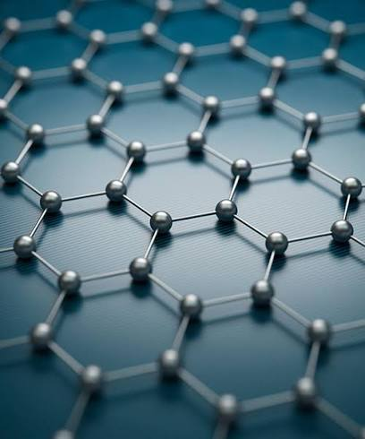
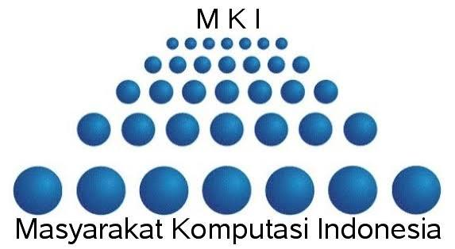

MKI × BRIN WORKSHOP

<h1>
Integrating First-Principles,
HPC & AI for Materials Discovery
</h1>

A computational materials science workshop
connecting quantum simulation, atomistic modeling,
high-performance computing, and artificial intelligence
for advanced materials research.

<a href="start-here/workshop-guide/">
Start Workshop →
</a>

<a href="start-here/workflow/">
Explore Workflow
</a>

WHY THIS WORKSHOP

<h2>
Building the Future of Computational Materials Discovery
</h2>

This workshop introduces an integrated computational
workflow combining first-principles calculations,
atomistic simulation, artificial intelligence,
and high-performance computing for advanced materials research.

⚛

<h3>
First-Principles Simulation
</h3>

Explore electronic structures and material properties
using density functional theory and Quantum ESPRESSO.

🧬

<h3>
Atomistic Modeling
</h3>

Investigate atomic interactions and molecular behavior
through molecular dynamics simulation approaches.

🤖

<h3>
AI Materials Discovery
</h3>

Accelerate materials research using machine learning
potential and data-driven computational methods.

💻

<h3>
High Performance Computing
</h3>

Perform large-scale simulations using parallel computing
and HPC infrastructure.

COMPUTATIONAL WORKFLOW

<h2>
From Atomic Structure to Materials Discovery
</h2>

A connected computational pathway that transforms
atomic-scale information into scientific insights
through simulation, artificial intelligence,
and high-performance computing.

01

<h3>
Atomic Structure
</h3>

Crystal structures,
interfaces, and molecular systems.

→

02

<h3>
First-Principles
</h3>

Quantum calculations
and electronic properties.

→

03

<h3>
Atomistic Simulation
</h3>

Molecular dynamics
and atomic interactions.

→

04

<h3>
AI Acceleration
</h3>

Machine learning
for faster discovery.

→

05

<h3>
HPC Computing
</h3>

Large-scale parallel
simulation.

→

06

<h3>
Materials Discovery
</h3>

New materials insights
and prediction.

Scroll horizontally to explore the complete computational pathway →

RESEARCH APPLICATIONS

<h2>
Applying Computational Workflow to Real Materials Systems
</h2>

The computational workflow is applied to different
materials systems to investigate electronic properties,
interfaces, and transport behavior.

01

ELECTRONIC STRUCTURE

<h3>
Graphene Electronic Structure
</h3>

Investigate electronic properties of graphene
through first-principles calculations.

DFT · Quantum ESPRESSO · DOS · Band Structure

02

INTERFACE MODELING

<h3>
Graphene Ionic Liquid Interface
</h3>

Study molecular interactions and interface
behavior using atomistic modeling approaches.

PACKMOL · Molecular Dynamics · Interface Modeling

03

IONIC TRANSPORT

<h3>
LiTFSI-EMIM TFSI Electrolyte Transport
</h3>

Analyze ionic transport mechanisms and
structural properties in electrolyte systems.

DC-DFTB-MD · MSD · RDF · Diffusion

RESEARCH CONNECTION

<h2>
Connecting Simulation to Scientific Questions
</h2>

Each computational approach is designed to answer
specific research questions, from electronic behavior
to atomic interactions and transport mechanisms.

01

<h3>
Electronic Properties
</h3>

How do atomic structures determine
electronic characteristics and material behavior?

DFT · DOS · Band Structure

02

<h3>
Atomic Interactions
</h3>

How do molecules and interfaces evolve
during atomistic simulations?

MD · PACKMOL · Interface Modeling

03

<h3>
Transport Mechanisms
</h3>

How do ions move and interact inside
complex electrolyte environments?

MSD · RDF · Diffusion Analysis

LEARNING ROADMAP

<h2>
A Structured Pathway for Computational Materials Science
</h2>

Follow the learning sequence from fundamental concepts
to advanced computational approaches for materials discovery.

01

<h3>
Foundation
</h3>

Introduction to materials informatics,
computational concepts, and research workflow.

↓

02

<h3>
First-Principles Simulation
</h3>

Electronic structure calculations,
density functional theory, and Quantum ESPRESSO workflow.

↓

03

<h3>
Atomistic Simulation
</h3>

Molecular dynamics,
interface modeling, and atomic-scale interactions.

↓

04

<h3>
AI Acceleration
</h3>

Machine learning potential
and data-driven materials discovery.

↓

05

<h3>
HPC Environment
</h3>

High-performance computing,
parallel simulation, and workflow automation.

↓

06

<h3>
Materials Discovery
</h3>

Advanced materials prediction
through integrated computational approaches.

CONTRIBUTOR

<h2>
Workshop Development Team
</h2>

Developed for computational materials science education
and research workflow training.

L

<h3>
Team MKI X BRIN
</h3>

Computational Materials Science Researcher

Research focus:

First-Principles Simulation,
Atomistic Modeling,
AI-Accelerated Materials Discovery,
and High Performance Computing.

WORKSHOP RESOURCES

<h2>
Access Materials and Computational Resources
</h2>

Explore documentation, simulation files,
and learning materials developed for this workshop.

<h3>
Documentation
</h3>

Complete workshop guide and computational workflow.

<h3>
Simulation Files
</h3>

Input files, structures, and computational examples.

<h3>
Research Examples
</h3>

Graphene, ionic liquid interface,
and electrolyte transport cases.

PARTNERS

<h2>
Workshop Collaboration
</h2>

Organized through collaboration between
MKI and BRIN for computational materials science research
and education.

×

