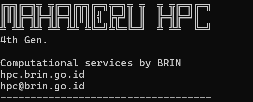

MKI × BRIN

<h1>
Computational Materials Science Workshop
</h1>

<h2>
First-Principles, HPC & AI for Materials Discovery
</h2>

A collaborative workshop exploring computational materials science
through quantum simulation, high-performance computing,
and artificial intelligence.

<a class="hero-button" href="workshop-introduction/">

Explore Workshop

</a>

<section class="about-section">

<h2>
About The Workshop
</h2>

The Computational Materials Science Workshop is a collaborative initiative
between Masyarakat Komputasi Indonesia (MKI) and BRIN to introduce
computational approaches for modern materials research.

The program integrates first-principles calculation,
high-performance computing, and artificial intelligence
to support materials discovery and scientific innovation.

</section>

<section class="focus-section">

<h2>
Research Focus
</h2>

01

<h3>
Quantum Simulation
</h3>

First-principles calculation and electronic structure analysis
using computational materials science approaches.

02

<h3>
High Performance Computing
</h3>

Utilization of HPC infrastructure to support advanced
materials simulation and scientific computation.

03

<h3>
AI Materials Discovery
</h3>

Application of artificial intelligence and data-driven methods
for accelerating materials research.

</section>

