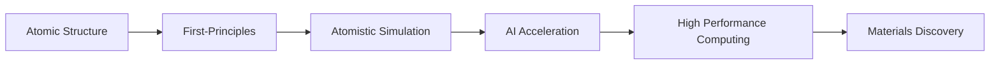

MKI × BRIN WORKSHOP

<h1>
Integrating First-Principles,
HPC & AI for Materials Discovery
</h1>

A computational materials science workshop
connecting quantum simulation, atomistic modeling,
high-performance computing, and artificial intelligence
for advanced materials research.

<a href="start-here/workshop-guide/">
Start Workshop →
</a>

<a href="start-here/workflow/">
Explore Workflow
</a>

---

WORKSHOP OVERVIEW

<h2>
Building the Future of Materials Discovery
</h2>

This workshop introduces computational approaches
that combine first-principles methods, atomistic
simulation, high-performance computing, and
artificial intelligence for materials research.

<h3>
01
 
Quantum Simulation
</h3>

Understand electronic structures
through first-principles calculations
using Density Functional Theory.

<h3>
02
 
Atomistic Modeling
</h3>

Explore molecular systems and
atomic-scale behavior through
advanced simulation workflows.

<h3>
03
 
AI & HPC Acceleration
</h3>

Accelerate materials discovery
using machine learning approaches
and high-performance computing.

---

COMPUTATIONAL ECOSYSTEM

<h2>
From Atomic Structure to Materials Discovery
</h2>

Computational materials research integrates
multiple scientific approaches into a connected
discovery pipeline.

```mermaid
flowchart LR

A[Atomic Structure]

B[First-Principles]

C[Atomistic Simulation]

D[AI Acceleration]

E[High Performance Computing]

F[Materials Discovery]


A --> B
B --> C
C --> D
D --> E
E --> F
```
---

LEARNING ROADMAP

<h2>
A Structured Pathway From Fundamentals to Research
</h2>

Follow the workshop pathway from basic concepts
to practical computational research applications.

01 Foundation

02 Quantum Simulation

03 Atomistic Simulation

04 AI Materials

05 HPC Computing

06 Research Cases

---

RESEARCH APPLICATIONS

<h2>
Applying Computational Methods to Real Materials Systems
</h2>

The workshop applies computational workflows
to representative materials research problems.

01

<h3>
Graphene Electronic Structure
</h3>

Electronic properties investigation
using first-principles calculations.

DFT · Quantum ESPRESSO · DOS

02

<h3>
Graphene Ionic Liquid Interface
</h3>

Atomic interaction analysis using
molecular simulation approaches.

PACKMOL · MD Simulation

03

<h3>
LiTFSI Electrolyte Transport
</h3>

Study ionic transport mechanisms
and structural properties.

DC-DFTB-MD · RDF · Diffusion

---

<h2>
Start Your Computational Research Journey
</h2>

Explore the modules, follow the workflow,
and experience computational materials discovery.

<a href="start-here/workshop-guide/">
Begin Workshop →
</a>

