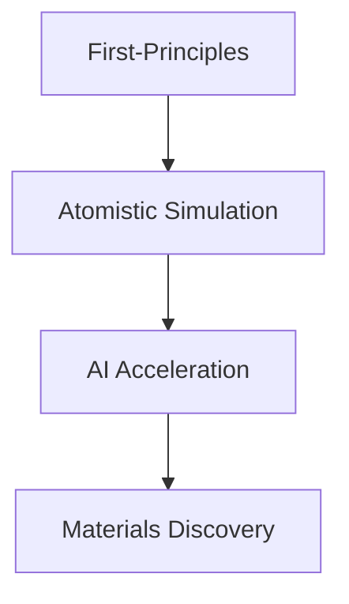

COMPUTATIONAL WORKFLOW

MKI × BRIN

<h1>
From Atomic Structure
to Materials Discovery
</h1>

A computational research workflow connecting
material modeling, simulation methods,
high-performance computing, and artificial intelligence
for advanced materials discovery.

DFT
MD
HPC
AI

Material

Simulation

Analysis

Discovery

RESEARCH MOTIVATION

<h2>
Why Computational Materials Science?
</h2>

Computational approaches enable researchers to
investigate materials behavior at atomic scale,
predict material properties, and accelerate
the discovery of advanced materials.

<h2>
From Simulation to Scientific Insight
</h2>

Material Design

Simulation

Analysis

Discovery

---

RESEARCH PIPELINE

<h2>
Computational Materials Discovery Workflow
</h2>

A complete workflow transforms material concepts
into scientific understanding through computational
modeling and analysis.

01

<h2>
Material Design
</h2>

Define material composition,
structure, and simulation targets.

Input: Atomic Structure

02

<h2>
Computational Simulation
</h2>

Apply quantum and atomistic
methods to investigate materials.

DFT · MD · AI

03

<h2>
Scientific Insight
</h2>

Extract material properties and
understand physical mechanisms.

DOS · RDF · Diffusion

MULTI-SCALE SIMULATION

<h2>
Connecting Different Computational Scales
</h2>

Materials behavior can be investigated through
different computational approaches, from electronic
structure calculations to large-scale atomic simulations.

<h3>
⚛ Electronic Scale
</h3>

First-principles methods describe
electronic structure and fundamental
material properties.

<strong>Methods</strong> 

DFT

<strong>Tools</strong> 

Quantum ESPRESSO

<h3>
🔬 Atomic Scale
</h3>

Atomistic simulations capture atomic
movement, interaction, and dynamic
behavior.

<strong>Methods</strong> 

MD · DC-DFTB-MD

<strong>Applications</strong> 

Structure · Transport

<h3>
🤖 AI Scale
</h3>

Machine learning approaches accelerate
materials simulation and prediction.

<strong>Methods</strong> 

Machine Learning Potential

<strong>Example</strong> 

MACE

COMPUTATIONAL INFRASTRUCTURE

<h2>
High Performance Computing Environment
</h2>

Large-scale computational materials research
requires high-performance computing resources
to execute simulations efficiently.

<h2>
HPC Research Workflow
</h2>

Linux Environment

Job Submission

Parallel Computing

Data Management

The HPC environment supports:

- Quantum ESPRESSO calculations
- DC-DFTB-MD simulations
- AI-based materials workflows
---

RESEARCH APPLICATIONS

<h2>
Applying Computational Workflow to Real Materials Systems
</h2>

The computational workflow is applied to different
materials systems to investigate electronic properties,
interfaces, and transport behavior.

01

<h2>
Graphene Electronic Structure
</h2>

Investigating electronic properties of graphene
using first-principles calculations.

<strong>Research Focus</strong> 
Electronic structure and material properties

  

<strong>Methods</strong> 
DFT · Quantum ESPRESSO

  

<strong>Outputs</strong> 
DOS · Band Structure

02

<h2>
Graphene Ionic Liquid Interface
</h2>

Understanding molecular interactions and interface
behavior through atomistic simulation.

<strong>Research Focus</strong> 
Surface and molecular interaction

  

<strong>Methods</strong> 
Molecular Building · PACKMOL · MD

  

<strong>Outputs</strong> 
Interface Structure · Atomic Behavior

03

<h2>
LiTFSI-EMIM TFSI Electrolyte Transport
</h2>

Analyzing ionic transport mechanisms and
structural properties in electrolyte systems.

<strong>Research Focus</strong> 
Ion movement and transport properties

  

<strong>Methods</strong> 
DC-DFTB-MD

  

<strong>Outputs</strong> 
MSD · RDF · Diffusion Coefficient

RESEARCH CONNECTION

<h2>
Connecting Simulation to Scientific Questions
</h2>

Each computational approach is designed to answer
specific research questions, from electronic behavior
to atomic interactions and transport mechanisms.

<h3>
⚛ Electronic Properties
</h3>

How does atomic structure influence
electronic behavior?

DFT · DOS · Band Structure

<h3>
🔬 Interface Behavior
</h3>

How do different materials interact
at atomic interfaces?

Molecular Modeling · MD

<h3>
⚡ Transport Mechanism
</h3>

How do ions move and contribute
to material performance?

MSD · RDF · Diffusion

---

<h2>
Explore the Computational Learning Path
</h2>

Continue your journey by exploring practical
modules and research-based computational workflows.

<h3>
⚛ First-Principles Simulation
</h3>

Explore density functional theory,
electronic structure calculation,
and Quantum ESPRESSO workflows.

<a href="../quantum-simulation/">
Explore Module →
</a>

<h3>
🧩 System Design
</h3>

Learn molecular building,
structure preparation, and interface
construction.

<a href="../atomistic-simulation/">
Explore Module →
</a>

<h3>
🚀 Atomistic Simulation
</h3>

Understand molecular dynamics,
DC-DFTB-MD, and trajectory analysis.

<a href="../atomistic-simulation/">
Explore Module →
</a>

<h3>
🧪 Research Cases
</h3>

Apply the complete workflow to
real computational materials problems.

<a href="../hands-on-project/">
Explore Cases →
</a>

<h2>
Start Your Computational Research Journey
</h2>

Move from fundamental concepts
to hands-on materials discovery.

<a href="../hands-on-project/">
Begin Research Cases →
</a>

