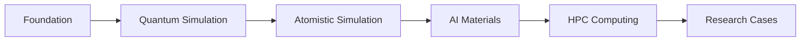

WORKSHOP GUIDE

MKI × BRIN

<h1>
Your Journey Into
Computational Materials Science
</h1>

A structured learning pathway that guides
participants from computational fundamentals
to hands-on materials research applications.

Learn
Simulate
Analyze
Discover

WORKSHOP OVERVIEW

<h2>
A Complete Computational Learning Experience
</h2>

This workshop combines scientific concepts,
computational methods, and practical workflows
for materials discovery.

<h3>
01
 
Understand
</h3>

Learn fundamental concepts in computational
materials science.

<h3>
02
 
Practice
</h3>

Execute simulation workflows using
scientific computing tools.

<h3>
03
 
Apply
</h3>

Explore research cases using
computational approaches.

LEARNING JOURNEY

<h2>
From Fundamentals to Research Applications
</h2>

The workshop follows a structured pathway
connecting theory, simulation, computing,
and research applications.

WORKSHOP STRUCTURE

<h2>
Learning Through Theory and Practice
</h2>

Theory

Tutorial

Hands-on

Discussion

Research Cases

BEFORE STARTING

<h2>
Prepare Your Computational Environment
</h2>

Participants will prepare the required
computational environment before running
simulation workflows.

<h3>
💻 HPC Access
</h3>

Account setup, terminal access,
and remote connection.

<h3>
⚙ Software Environment
</h3>

Required simulation tools
and computational packages.

<h3>
📂 Workshop Files
</h3>

Input files, examples,
and supporting materials.

LEARNING SUPPORT

<h2>
Resources During the Workshop
</h2>

Use additional resources to support
your computational learning process.

<h3>
🤖 AI Help Center
</h3>

Get assistance for Linux,
simulation tools, and workflows.

<a href="../resources/ai-help/">
Open Assistant →
</a>

<h3>
📚 Documentation
</h3>

Access software guides,
references, and examples.

<a href="../references/">
Explore Resources →
</a>

<h2>
Ready to Start Computational Research?
</h2>

Follow the learning path and begin exploring
materials simulation workflows.

<a href="../quantum-simulation/">
Start Learning →
</a>

